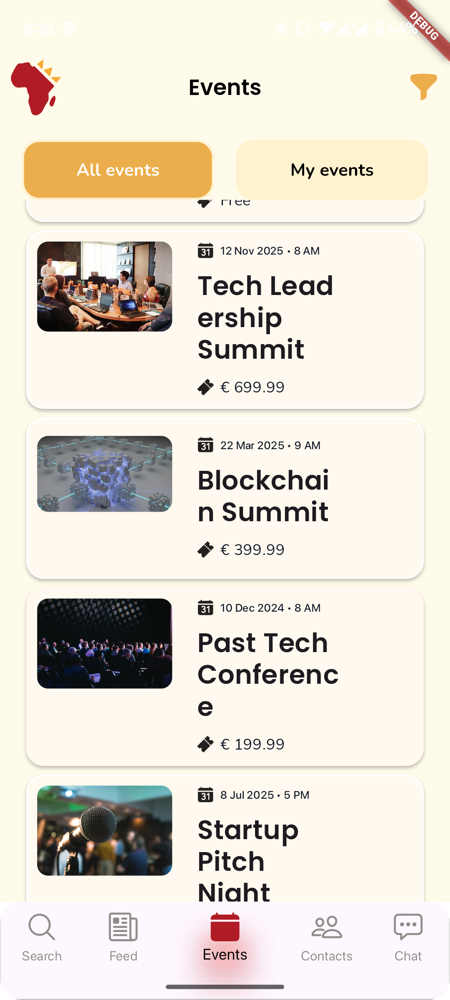
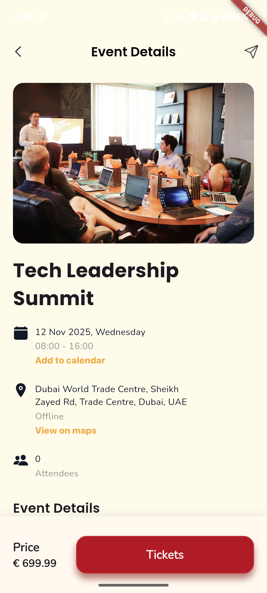
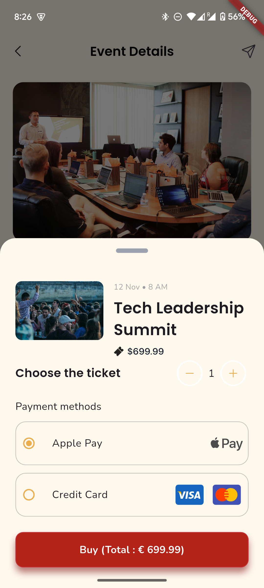
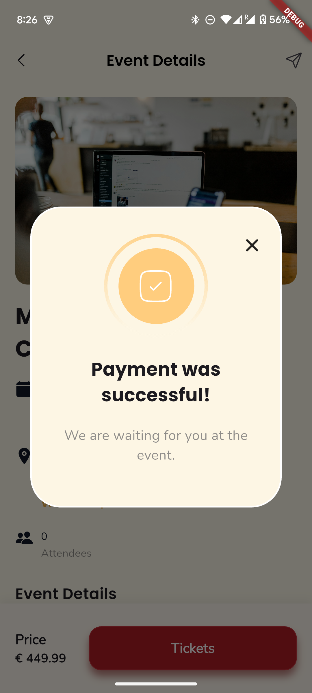
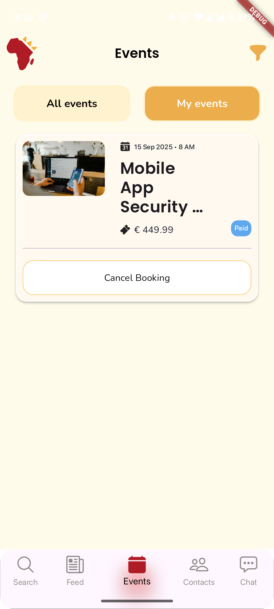
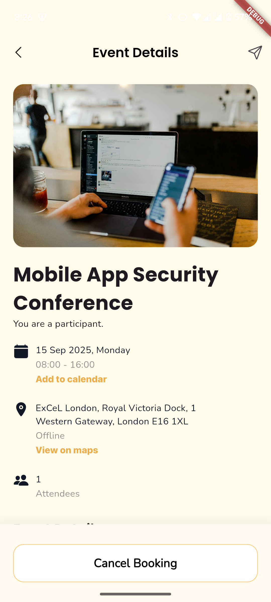
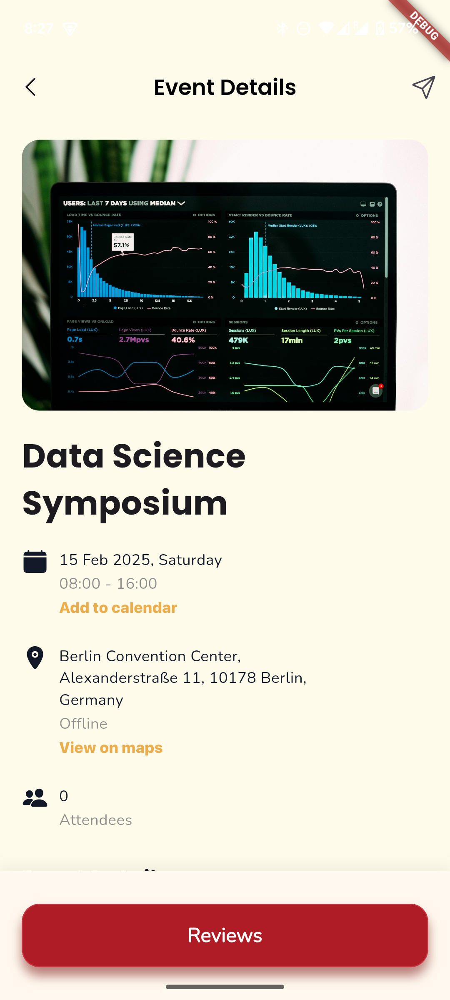
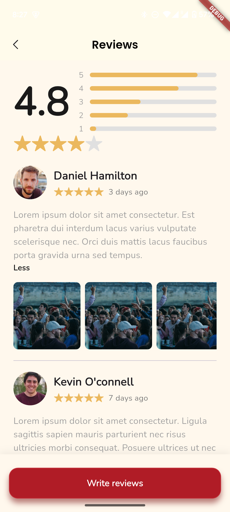

# Repat Event

![coverage][coverage_badge]
[![style: very good analysis][very_good_analysis_badge]][very_good_analysis_link]
[![License: MIT][license_badge]][license_link]

## Overview

Repat Event is a comprehensive event management application built with Flutter and Firebase. The app allows users to discover, book, and manage events, with features for both event attendees and organizers. The application follows clean architecture principles and uses BLoC pattern for state management.

---

## Features 🌟

### Core Features

- **Event Discovery**: Browse and search for upcoming events with filtering options
- **Event Registration**: Register for events with ticket purchasing functionality
- **Event Management**: View registered events and manage bookings
- **Booking Cancellation**: Cancel event bookings with reason tracking
- **Event Reviews**: Leave reviews for past events
- **User Authentication**: Secure login with Firebase Authentication

### Technical Features

- **Clean Architecture**: Separation of concerns with domain, data, and presentation layers
- **BLoC Pattern**: Reactive state management using the BLoC pattern
- **Firebase Integration**: Real-time data with Cloud Firestore
- **Responsive UI**: Beautiful and responsive UI that works across devices
- **Offline Support**: Basic functionality works offline with data synchronization
- **Error Handling**: Comprehensive error handling and user feedback

## Architecture 🏗️

The application follows Clean Architecture principles with the following layers:

- **Domain Layer**: Contains business logic, entities, and use cases
- **Data Layer**: Implements repositories and data sources
- **Presentation Layer**: Contains UI components and BLoC state management

### Project Structure

```
lib/
├── core/                     # Core functionality and utilities
│   ├── errors/               # Error handling
│   ├── fixtures/             # Test fixtures
│   ├── themes/               # App themes
│   └── usecases/             # Base use case definitions
├── features/                 # Feature modules
│   ├── app/                  # App initialization
│   ├── auth/                 # Authentication
│   └── events/               # Events feature
│       ├── data/             # Data layer (repositories, models, sources)
│       ├── domain/           # Domain layer (entities, use cases)
│       └── presentation/     # Presentation layer (UI, bloc)
└── l10n/                     # Localization
```

## Getting Started 🚀

This project contains 3 flavors:

- development
- staging
- production

To run the desired flavor either use the launch configuration in VSCode/Android Studio or use the following commands:

```sh
# Development
$ flutter run --flavor development --target lib/main_development.dart

# Staging
$ flutter run --flavor staging --target lib/main_staging.dart

# Production
$ flutter run --flavor production --target lib/main_production.dart
```

### Prerequisites

- Flutter SDK (version 3.6.0 or higher)
- Dart SDK (version 3.6.0 or higher)
- Firebase project setup
- Android Studio / VS Code with Flutter extensions

### Firebase Setup

1. Create a Firebase project in the [Firebase Console](https://console.firebase.google.com/)
2. Add Android and iOS apps to your Firebase project
3. Download and add the configuration files (google-services.json, GoogleService-Info.plist)
4. Enable Authentication and Firestore in the Firebase Console

_\*Repat Event works on iOS, Android, Web, and Windows._

---

## UI Illustrations 📱

Below are screenshots showcasing the key screens and features of the Repat Event application:

| Screen | Screenshot |
|--------|-----------|
| Events List |  |
| Event Details |  |
| Event Registration |  |
| Payment Confirmation |  |
| Booking Cancellation |  |
| Success Dialog |  |
| User Events |  |
| Reviews |  |

---

## Running Tests 🧪

To run all unit and widget tests use the following command:

```sh
$ flutter test --coverage --test-randomize-ordering-seed random
```

To view the generated coverage report you can use [lcov](https://github.com/linux-test-project/lcov).

```sh
# Generate Coverage Report
$ genhtml coverage/lcov.info -o coverage/

# Open Coverage Report
$ open coverage/index.html
```

---

## Working with Translations 🌐

This project relies on [flutter_localizations][flutter_localizations_link] and follows the [official internationalization guide for Flutter][internationalization_link].

### Adding Strings

1. To add a new localizable string, open the `app_en.arb` file at `lib/l10n/arb/app_en.arb`.

```arb
{
    "@@locale": "en",
    "counterAppBarTitle": "Counter",
    "@counterAppBarTitle": {
        "description": "Text shown in the AppBar of the Counter Page"
    }
}
```

2. Then add a new key/value and description

```arb
{
    "@@locale": "en",
    "counterAppBarTitle": "Counter",
    "@counterAppBarTitle": {
        "description": "Text shown in the AppBar of the Counter Page"
    },
    "helloWorld": "Hello World",
    "@helloWorld": {
        "description": "Hello World Text"
    }
}
```

3. Use the new string

```dart
import 'package:repat_event/l10n/l10n.dart';

@override
Widget build(BuildContext context) {
  final l10n = context.l10n;
  return Text(l10n.helloWorld);
}
```

### Adding Supported Locales

Update the `CFBundleLocalizations` array in the `Info.plist` at `ios/Runner/Info.plist` to include the new locale.

```xml
    ...

    <key>CFBundleLocalizations</key>
	<array>
		<string>en</string>
		<string>es</string>
	</array>

    ...
```

### Adding Translations

1. For each supported locale, add a new ARB file in `lib/l10n/arb`.

```
├── l10n
│   ├── arb
│   │   ├── app_en.arb
│   │   └── app_es.arb
```

2. Add the translated strings to each `.arb` file:

`app_en.arb`

```arb
{
    "@@locale": "en",
    "counterAppBarTitle": "Counter",
    "@counterAppBarTitle": {
        "description": "Text shown in the AppBar of the Counter Page"
    }
}
```

`app_es.arb`

```arb
{
    "@@locale": "es",
    "counterAppBarTitle": "Contador",
    "@counterAppBarTitle": {
        "description": "Texto mostrado en la AppBar de la página del contador"
    }
}
```

### Generating Translations

To use the latest translations changes, you will need to generate them:

1. Generate localizations for the current project:

```sh
flutter gen-l10n --arb-dir="lib/l10n/arb"
```

Alternatively, run `flutter run` and code generation will take place automatically.

[coverage_badge]: coverage_badge.svg
[flutter_localizations_link]: https://api.flutter.dev/flutter/flutter_localizations/flutter_localizations-library.html
[internationalization_link]: https://flutter.dev/docs/development/accessibility-and-localization/internationalization
[license_badge]: https://img.shields.io/badge/license-MIT-blue.svg
[license_link]: https://opensource.org/licenses/MIT
[very_good_analysis_badge]: https://img.shields.io/badge/style-very_good_analysis-B22C89.svg
[very_good_analysis_link]: https://pub.dev/packages/very_good_analysis
[very_good_cli_link]: https://github.com/VeryGoodOpenSource/very_good_cli
